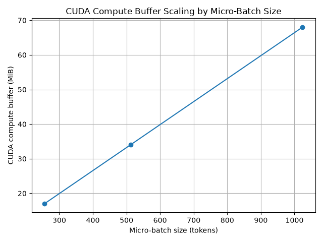
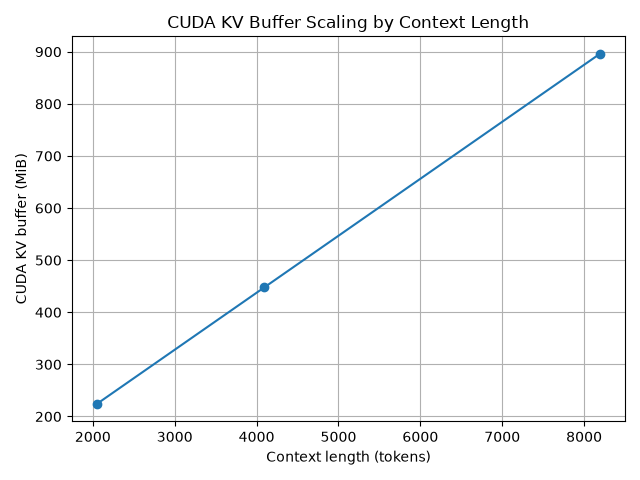
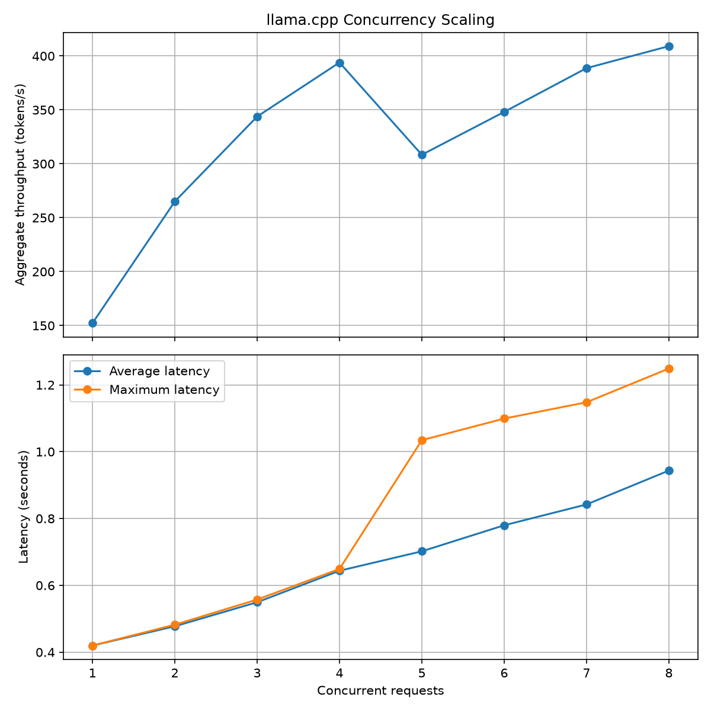

# LLM VRAM Fit

This Python CLI checks which GGUF files from a Hugging Face model repository fit inside the available VRAM of a GPU. Instead of trusting nominal quantization labels such as Q4 or Q8 as exact measurements, it fetches the real file sizes from Hugging Face and uses those for its calculations.

## What it does

- Fetches the available GGUF files and their sizes from the Hugging Face API.
- Checks each GGUF file independently against the submitted GPU size.
- Estimates how much VRAM remains after the artifact and CUDA overhead.
- Calculates how many FP16 KV-cache tokens fit into the remaining memory.
- Prevents the result from exceeding the context length supported by the model.
- Prints the results and saves the full report to `report.txt`.

## Installation

```bash
git clone https://github.com/juanrokhuder/llm-vram-fit.git
cd llm-vram-fit
python3 -m venv .venv
source .venv/bin/activate
pip install -r requirements.txt
```

## Usage

Run the CLI and enter the GPU size in GiB when asked:

```bash
python3 model_fit_advisor.py
```

You can also provide the GPU size directly as a positional argument:

```bash
python3 model_fit_advisor.py 12
```

`models.json` is always loaded from beside the script, so the CLI can be launched from a different directory. `report.txt` is created in the directory from which the command was run.

## Adding models

Models can be added, changed, or removed through `models.json`. Each model needs:

- `name`: The name displayed in the report.
- `num_hidden_layers`: The number of transformer layers.
- `num_key_and_value_heads`: The number of KV heads.
- `head_dim`: The size of each attention head.
- `max_position_embeddings`: The maximum context length supported by the model.
- `repo_id`: The Hugging Face repository containing the GGUF files.

These architecture values can usually be found in the model's `config.json` on Hugging Face. If `head_dim` is not listed directly, it can commonly be calculated by dividing `hidden_size` by `num_attention_heads`.

Example:

```json
{
    "name": "Qwen3-8B",
    "num_hidden_layers": 36,
    "num_key_and_value_heads": 8,
    "head_dim": 128,
    "max_position_embeddings": 40960,
    "repo_id": "Qwen/Qwen3-8B-GGUF"
}
```

## Assumptions

This tool produces an estimate, not a guarantee that a model will load successfully. It currently assumes:

- The GGUF file size is a reasonable estimate of its VRAM weight footprint.
- CUDA runtime overhead uses a fixed `0.5 GiB`.
- The KV cache uses FP16 at two bytes per element.
- The Hugging Face repository exposes the GGUF file sizes through its API.

Actual memory usage can differ because of the inference backend, hardware, memory fragmentation, and additional runtime buffers that are not included yet.

## Measured llama.cpp benchmarks

The `benchmarks/` directory has measurements from running Qwen3-0.6B Q8_0 with llama.cpp on an NVIDIA GeForce RTX 3050 Laptop GPU with 4 GB of VRAM.

Two controlled memory experiments change one setting at a time:

- At a fixed context length of 8192 tokens, increasing the micro-batch size from 256 to 512 and 1024 increased the CUDA compute buffer from 17.01 MiB to 34.01 MiB and 68.02 MiB.
- At a fixed micro-batch size of 256, increasing context length from 2048 to 4096 and 8192 tokens increased the CUDA KV buffer from 224 MiB to 448 MiB and 896 MiB.





The concurrency benchmark sends 64-token requests at concurrency levels 1 through 8, with five repetitions per level. In the recorded run, aggregate throughput scaled cleanly through four concurrent requests. At five requests, maximum latency rose sharply from about 0.65 to 1.03 seconds, revealing a queueing and tail-latency boundary even though throughput increased again at higher concurrency.



Raw measurements and summarized results are included as CSV files so the conclusions remain viewable instead of just existing as charts.

## Support case studies

The support case studies document real llama.cpp/API failures, their root causes, fixes and verification.

- [Unreachable llama.cpp Server](support_cases/case_01_unreachable_llama_server.md)
- [Malformed Chat-Completion Request](support_cases/case_02_malformed_chat_request.md)

## Tests

Run the test suite with:

```bash
pytest -v
```
